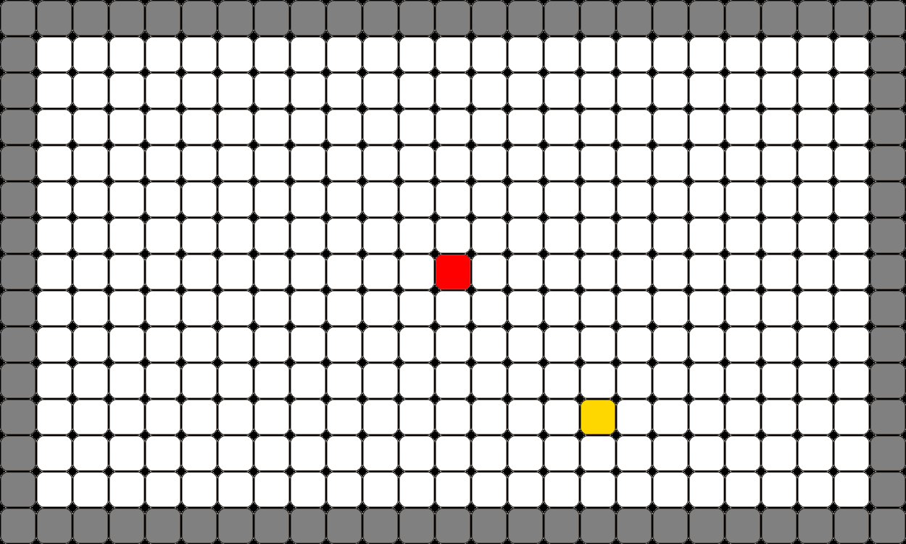

# Snake (May 2015)

Classic Snake Game developed in C++ with SFML

## Project Description

Move around and collect yellow blocks to increase in size while avoiding your own tail. The goal is to survive as much as possible.

